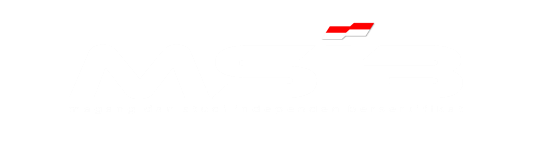
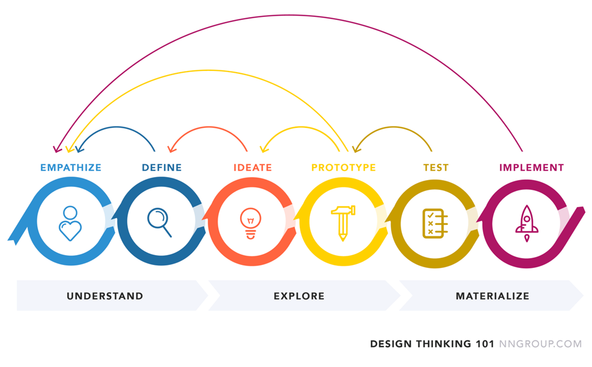
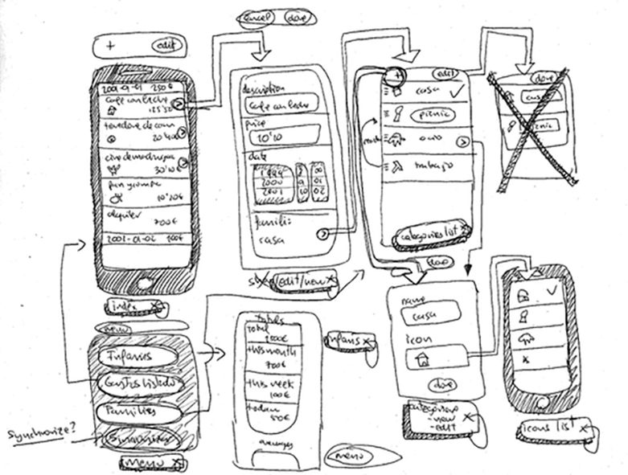

# Product Development Bootcamp - Materi Minggu Pertama

 

<h3 style="background-color:red;padding:3px;text-align:center;font-weight:bold;">Design Thinking</h3>

Disini saya berhasil memahami tentang apa itu design thinking baik secara definisi umum ataupun secara pemahaman. Design thinking adalah sebuah pendekatan kreatif yang dilakukan untuk menyelesaikan sebuah masalah atau menciptakan solusi.
 

<strong style="color:red;">Kenapa Design Thinking itu diperlukan?</strong> Agar solusi yang dibuat bisa tepat dan menjawab permasalahan yang ada. 

<strong style="color:red;">Kenapa dengan melakukan pendekatan design thinking bisa menjawab pertanyaan?</strong>  karena design thinking dibuat untuk dapat mengerti permasalahan-permasalahan 
dari si user, sehingga permasalahan yang ada dapat dicari solusinya dan dijawab dengan tepat.
 

Design Thinking memiliki beberapa tahapan diantaranya :

 

1.	Understand
Mencari permasalahan yang ada pada si user serta mendefinisikannya
-	Emphatize
: Memahami kebutuhan-kebutuhan users
-	Define(Reframe The Problem)
: Mendefinisikan permasalahan sesuai dengan kebutuhan users
2.	Explore
Melakukan eksplorasi lebih lanjut untuk dapat mencari solusi hingga kita dapat membentuk suatu rancangan prototype
-	Ideate(Brainstorms)
: Membuat ide atau solusi berdasarkan pendefinisian permasalahan yang ada

 

-	Prototype
: Membuat model eksperimental/tiruan untuk mencoba menangani permasalahan yang ada pada si users.
3.	Materialize
Jika protoype sudah dianggap sesuai maka kita bisa lanjut ke tahap implementasi atau pengembangan sistem yang akan kita bangun
-	Testing
: Melakukan testing prototype apakah sudah sesuai dan dapat menjadi solusi untuk  permasalahan si user
-	Implement
: Jika testing berjalan dengan lancar kita dapat masuk ke tahap implement untuk dapat melakukan pengembangan sistem

Setelah selesai memahami poin-poin dasar dari Design Thinking, saya juga mendapat pemahaman mengenai bagaimana cara pengerjaan latihan Design Thinking menggunakan figma yang akan mengambil studi kasus sesuai dari challange masing-masing peserta.

>-	Versi awal / MVP(Minimum Viable Product)
:  merupakan versi awal dari produk kita yang layak pakai untuk bisa rilis dan dipakai oleh user sesuai dengan kebutuhan utama dari si user dan tentunya sudah layak pakai.
Definisi layak pakai itu apa?
Bisa dibilang produk yang (Must-have) yang bisa melayani tujuan (hasil yang kita harapkan) dari aplikasi kita.
misal aplikasi toko online : Apakah fitur-fitur yang ada di aplikasi tersebut sudah mendukung sistem penjualan produk secara online?

Saat setelah produk kita rilis
Dari sisi kita sebagai pemilik aplikasi, jika aplikasi kita sudah di publish dan dipakai oleh user, kita bisa mendengarkan feedback user untuk improvement selanjutnya.

Dengan cara apa kita bisa memprioritaskan fitur yang kita buat?
>Kano Model
>: Suatu kerangka yang kita gunakan untuk memprioritaskan fitur-fitur produk kita sesuai dengan tahapan-tahapan yang ada 
>Tahapan-Tahapan dalam Kano Model :
>1.	Must-have features (Basic)
>Membantu menyelesaikan permasalahan utama.
>2.	Performance features (Satisfier)
>Mengimprove fitur tambahan untuk meningkatkan kepuasan user.
>3.	Nice-to-have features (Delighter)
>Fitur yang tidak terlalu dibutuhkan tapi akan sangat menarik jika ditambahkan.

<strong>Pengenalan apa itu Product Requirement Documents (PRD)</strong> 
<strong>Definisi :</strong> 
Adalah sebuah dokumentasi yang menjadi acuan kita dalam membangun suatu produk, biasanya yang membuat adalah product owner atau product manager.
Tujuan
Untuk membuat pemahaman tentang kebutuhan produk yang sedang dibangun tertuang dalam satu dokumen supaya bisa dipahami semua anggota tim.
Living Documentation
Seiring berjalannya proyek, harus terus diupdate dan ditinjau lagi.
Kebutuhan produk apa saja yang perlu didokumentasi?
o	Latar belakang permasalahan
: Permasalahan apa yang kita angkat

o	Riset
: Riset bukti yang mendukung permasalahan yang  diangkat
o	Solusi
: Solusi apa yang kita tawarkan kepada pengguna
o	Platform
: Platform apa yang dipakai?mobile atau website
o	Tanggal rilis dan jadwal
: Demo day dan kapan jadwal pengerjaan dilakukan, seperti UI design ataupun Development
o	Tipe Pengguna
: Siapa saja pengguna produk kita

